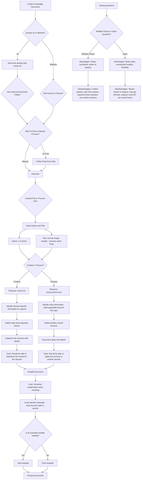

```mermaid
flowchart TD
    A[Create Knowledge Document]
    A --> B{Genetic AI or Website?}
    B -->|AI| C1[Name file starting with temp.md]
    C1 --> C{Has Internal Documents Folder?}
    B -->|Website| D{Has Access to Canvas?}
    C --> E{After AI Chat or Manual Process?}
    D --> E
    E -->|Manual| G[Interview]
    E -->|AI Chat| F[Collect Data from Chat]
    F --> G
    G --> H{Content File or Process File?}
    H --> N[Select Name and Title]
    N --> N1[Name: 1-2 words]
    N --> N2[Title: Can be longer, wordier - conveys same thing]
    N1 --> H2{Content or Process?}
    N2 --> H2
    H2 -->|Content| I[Filename: name.md]
    I --> I1[Identify domain-specific information to capture]
    I1 --> I2[Gather high-level important pieces]
    I2 --> I3[Organize into sections with details]
    I3 --> I4[Goal: Should be able to reproduce the content in this domain]
    I4 --> S[Simplify Document]
    
    H2 -->|Process| J[Filename: name.process.md]
    J --> J1[Identify meta information - skills applicable beyond this repo]
    J1 --> J2[Gather/confirm overall process]
    J2 --> J3[Document steps and details]
    J3 --> J4[Goal: Should be able to apply this process in another domain]
    J4 --> S[Simplify Document]
    S --> S1[Goal: Smoother collaboration when revisiting]
    S1 --> S2[Avoid specific examples - they become stale or anchor]
    S2 --> S3{Is an example actually needed?}
    S3 -->|Yes| S4[Add example]
    S3 -->|No| S5[Omit example]
    S4 --> P[Produce Document]
    S5 --> P

    Q[Asking Questions]
    Q --> Q1{Multiple Choice or Open Question?}
    Q1 -->|Multiple Choice| Q2[Advantages: Faster, consistent, easier to analyze]
    Q2 --> Q2d[Disadvantages: Limited options, may miss nuance, requires known answers, can anchor answers]
    Q1 -->|Open| Q3[Advantages: Richer data, unexpected insights, flexibility]
    Q3 --> Q3d[Disadvantages: Slower, harder to analyze, may get off-track, requires more EF, can cause freeze]
```