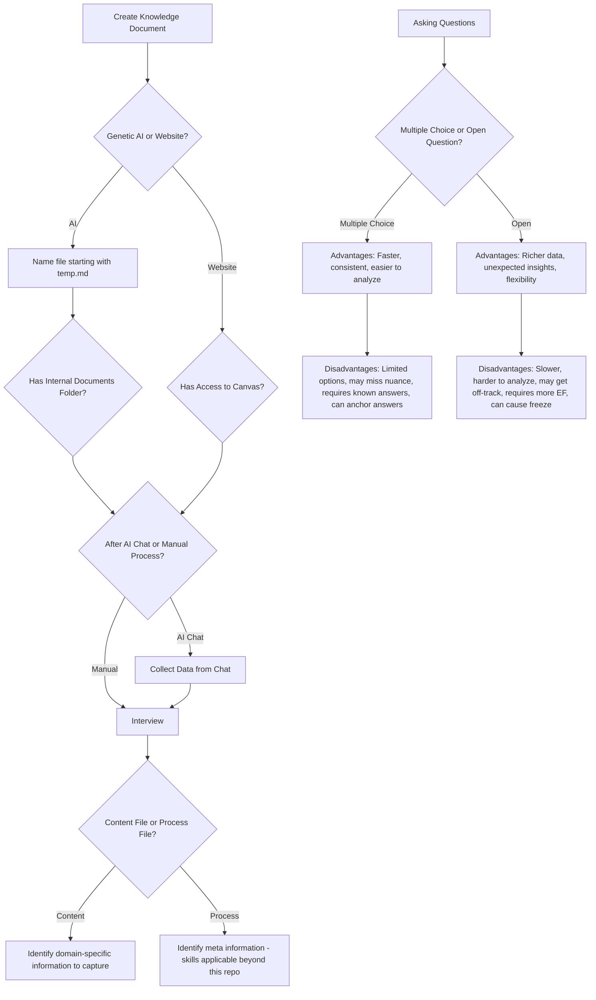

```mermaid
flowchart TD
    A[Create Knowledge Document]
    A --> B{Genetic AI or Website?}
    B -->|AI| C1[Name file starting with temp.md]
    C1 --> C{Has Internal Documents Folder?}
    B -->|Website| D{Has Access to Canvas?}
    C --> E{After AI Chat or Manual Process?}
    D --> E
    E -->|Manual| G[Interview]
    E -->|AI Chat| F[Collect Data from Chat]
    F --> G
    G --> H{Content File or Process File?}
    H -->|Content| I[Identify domain-specific information to capture]
    H -->|Process| J[Identify meta information - skills applicable beyond this repo]

    Q[Asking Questions]
    Q --> Q1{Multiple Choice or Open Question?}
    Q1 -->|Multiple Choice| Q2[Advantages: Faster, consistent, easier to analyze]
    Q2 --> Q2d[Disadvantages: Limited options, may miss nuance, requires known answers, can anchor answers]
    Q1 -->|Open| Q3[Advantages: Richer data, unexpected insights, flexibility]
    Q3 --> Q3d[Disadvantages: Slower, harder to analyze, may get off-track, requires more EF, can cause freeze]
```